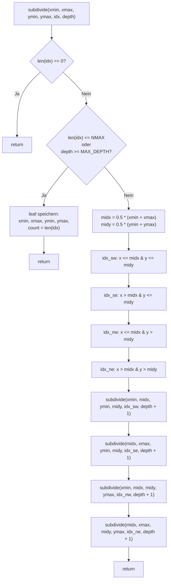

## QuadTree: Funktion `subdivide`

Die Funktion `subdivide` implementiert eine rekursive Raumaufteilung (QuadTree), um ein adaptives Gitter basierend auf der Dichte von Punkten (hier: Erdbeben) zu erzeugen.

### Idee

Anstatt ein fixes Raster zu verwenden, wird der Raum so lange in vier gleich große Teilbereiche (Quadranten) unterteilt, bis eine Abbruchbedingung erfüllt ist:

- entweder enthält die Zelle höchstens `NMAX` Punkte
- oder eine maximale Rekursionstiefe `MAX_DEPTH` ist erreicht

Dadurch entstehen kleine Zellen in dichten Regionen und große Zellen in dünn besetzten Bereichen.

### Parameter

- `xmin, xmax, ymin, ymax`  
  Begrenzen das aktuelle Rechteck (Bounding Box)

- `idx`  
  Indizes der Punkte, die innerhalb dieser Box liegen

- `depth`  
  Aktuelle Rekursionstiefe

### Ablauf

1. **Leerer Bereich**  
   Wenn keine Punkte enthalten sind → Abbruch

2. **Abbruchbedingung erfüllt**  
   Wenn `len(idx) <= NMAX` oder `depth >= MAX_DEPTH`:
   - Speichere die Zelle als Leaf
   - Beende Rekursion

3. **Aufteilung**  
   - Berechne Mittelpunkt `(midx, midy)`
   - Teile die Punkte in vier Quadranten:
     - SW (unten links)
     - SE (unten rechts)
     - NW (oben links)
     - NE (oben rechts)

4. **Rekursion**  
   Rufe `subdivide` für jeden Quadranten erneut auf

### Ergebnis

Die Funktion erzeugt eine Liste von „Blättern“ (`leaves`), wobei jede Zelle enthält:

- ihre räumliche Ausdehnung (`xmin, xmax, ymin, ymax`)
- die Anzahl der enthaltenen Punkte (`count`)

Diese Struktur entspricht einem adaptiven Grid und ist besonders gut geeignet für:

- räumliche Modellierung (z. B. Poisson-Modelle)
- Heatmaps mit variabler Auflösung
- effiziente Approximation dichter Punktwolken

